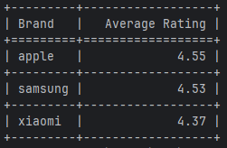
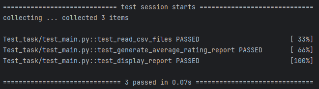

# Анализ рейтинга брендов 📊

Скрипт для обработки CSV-файлов с данными о товарах (название, бренд, цена, рейтинг) и генерации отчётов. **Реализован отчёт `average-rating`**: список брендов с их средним рейтингом, отсортированный по убыванию.

## ✨ Выполненные требования
✅ **Функциональные**:
- Передача путей к файлам через `--files`
- Указание типа отчёта через `--report`
- Табличный вывод в консоль
- Обработка нескольких CSV-файлов одновременно

✅ **Нефункциональные**:
- Только стандартные библиотеки (argparse, csv) + tabulate для вывода
- Модульная архитектура для добавления новых отчётов
- Покрытие тестами на pytest

## 📋 Требования
- Python 3.x
- Установка зависимостей: `pip install -r requirements.txt`

## 🗂 Структура проекта
.
├── main.py          # Основной скрипт
├── test_main.py     # Тесты pytest
├── data/            # Примеры CSV
│   ├── products1.csv
│   └── products2.csv
├── screenshots/     # Скриншоты
├── requirements.txt # Зависимости
├── .gitignore       # Игнорируемые файлы
└── README.md        # Документация

## ⚙️ Установка и запуск
1. **Клонируйте репозиторий**:
git clone https://github.com/MaksMaksimych/average_rating.git
cd average_rating

2. **Создайте виртуальное окружение**:
python -m venv venv
venv\Scripts\activate  # Windows

3. **Установите зависимости**:
pip install -r requirements.txt

4. **Запустите скрипт**:
python main.py --files data/products1.csv data/products2.csv --report average-rating

## 🧪 Тестирование
pytest

**Все 3 теста проходят успешно** (покрытие: чтение CSV, генерация отчёта, вывод таблицы).

## 📸 Скриншоты

### Запуск программы

### Результаты тестов

## 🔧 Архитектура
- **Модульность**: Новые отчёты добавляются через словарь `report_functions`
- **Расширяемость**: Легко добавить `average-price` или другие отчёты
- **Чистый код**: Соответствует PEP 8, разделён на функции

## ➕ Расширение функционала
Для добавления нового отчёта (например, **средняя цена**):
1. Создать `generate_average_price_report(data)`
2. Добавить в `report_functions`
3. Обновить `display_report`
4. Добавить в `choices` argparse

